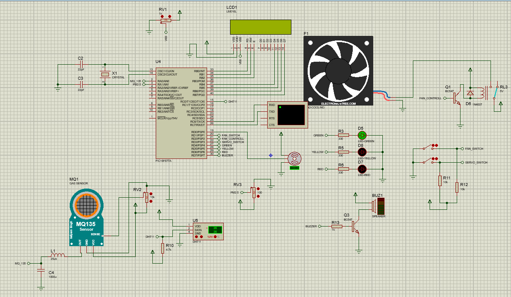
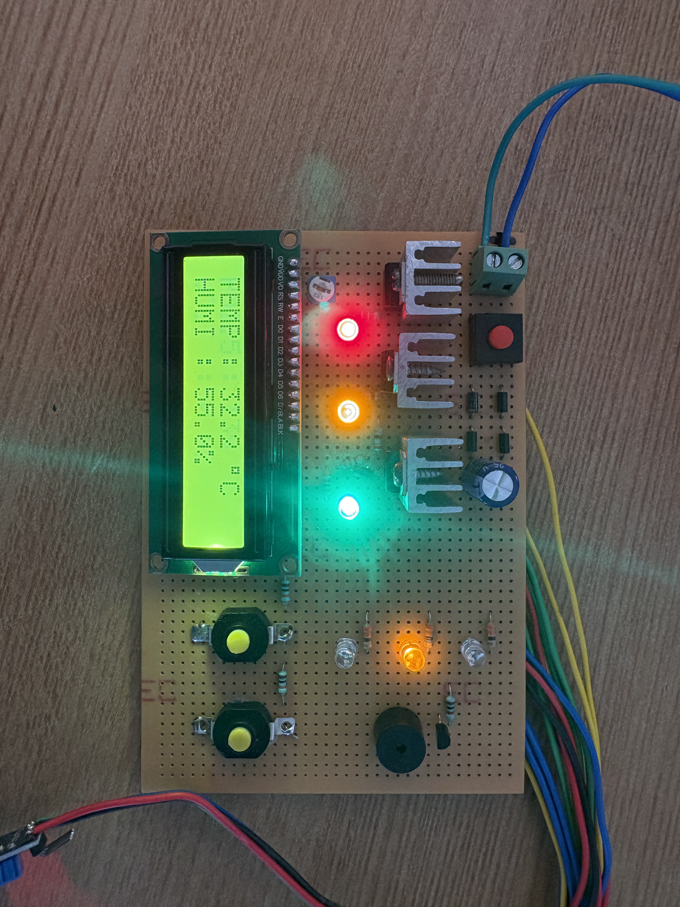
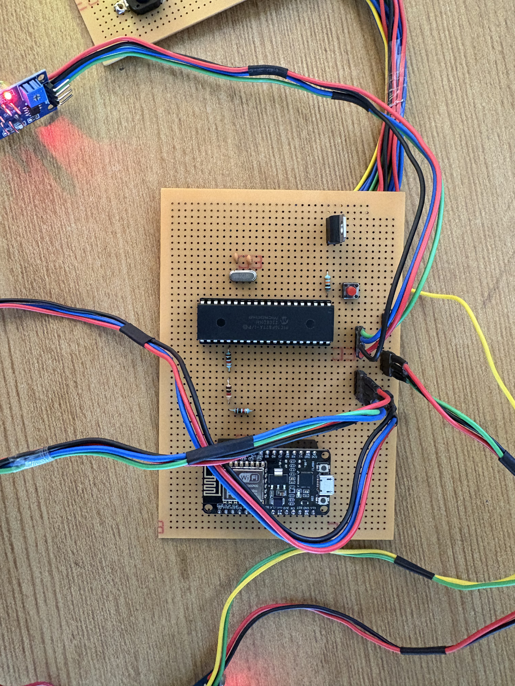

# 🌬️ Air Quality Monitoring System

A smart **IoT-based Air Quality Monitoring System** using **PIC16F877A Microcontroller** and **ESP8266 NodeMCU Wi-Fi module**.  
This system continuously monitors air pollutants like CO, CO₂, and particulate matter, and transmits real-time data to the **Blynk mobile application** for visualization and alerts.  

---

## 📽️ Demo Video

🎥 Watch the full project demonstration on YouTube:  

---

## ⚙️ Project Overview

The **Air Quality Monitoring System** is designed to track air pollution levels in the surrounding environment.  
Using **gas sensors (MQ135/MQ7)**, the system measures harmful gases and sends real-time data via **ESP8266 NodeMCU** to the **Blynk IoT platform**, allowing users to monitor the Air Quality Index (AQI) through a mobile dashboard.

This helps in detecting pollution early and taking preventive actions to ensure a healthy environment.

---

## 🧠 Features

- 🌡️ Real-time air quality monitoring  
- 📶 Wireless data transmission using ESP8266 NodeMCU  
- 📱 Live data display on **Blynk mobile app**  
- 💡 LCD display showing gas concentration levels  
- 🚨 Alerts when air quality exceeds safe thresholds  
- 🔋 Low power consumption and compact design  

---

## 🧩 Components Used

| Component | Description |
|------------|-------------|
| **PIC16F877A** | Main microcontroller for data processing |
| **ESP8266 NodeMCU** | Wi-Fi module for IoT connectivity |
| **MQ135 / MQ7 Gas Sensor** | Detects harmful gases (CO, CO₂, NH₃, Benzene, etc.) |
| **16x2 LCD Display** | Displays gas levels locally |
| **Blynk Application** | Mobile interface for live monitoring |
| **Power Supply (5V/12V)** | Provides power to circuit modules |
| **Resistors, Capacitors, Breadboard, Jumper Wires** | Basic electronic components |

---

## 🔌 Circuit Description

- The **gas sensor** detects the concentration of pollutants and sends analog signals to the **PIC16F877A ADC pins**.  
- The **PIC microcontroller** processes the readings and displays them on the **LCD module**.  
- Data is sent to the **ESP8266 Wi-Fi module**, which transmits the readings to the **Blynk server**.  
- Users can view **real-time AQI data** on the **Blynk mobile dashboard**.

---

## 📱 Blynk Dashboard Setup

1. Install the **Blynk IoT app** (available on Android/iOS).  
2. Create a new project → Select **ESP8266** as device.  
3. Add the following widgets:
   - Gauge → for CO₂ / CO level
   - Graph → for live data visualization
   - Notification → for alert messages  
4. Copy the **Auth Token** and paste it into the microcontroller code.  
5. Connect to Wi-Fi and run the system — data appears instantly!

---

## 🧰 Software Tools

- **MPLAB X IDE** – for PIC programming  
- **PIC C Compiler (CCS / MikroC)** – for writing the firmware  
- **Blynk IoT Platform** – for cloud monitoring  
- **Proteus** – for circuit simulation (optional)

---

## 🧾 Working Algorithm

1. **Start system** – Initialize sensors and Wi-Fi.  
2. **Read gas levels** – Measure analog input from sensors.  
3. **Convert & process** – Calculate AQI using ADC values.  
4. **Display** – Show results on LCD and send to ESP8266.  
5. **Upload data** – ESP8266 posts to Blynk Cloud.  
6. **Monitor remotely** – View live data on the mobile app.

---

## 📊 Example Output

| Parameter | Sensor Value | Air Quality Status |
|------------|---------------|--------------------|
| CO₂ Level | 420 ppm | Good |
| CO Level | 3 ppm | Normal |
| AQI | 75 | Moderate |

---

## 📷 Project Images 
Example:  

  
  

---

## 🧩 Applications

- 🏠 Indoor Air Quality Monitoring  
- 🏭 Industrial Pollution Detection  
- 🚗 Vehicle Emission Monitoring  
- 🌳 Smart City Environmental Monitoring  
- 🏫 Educational and Research Projects  

---

## 👨‍🔬 Future Enhancements

- Integration with **ThingSpeak** or **Google Sheets** for data logging  
- Addition of **temperature and humidity** sensors (DHT11/DHT22)  
- Implementation of **automatic air purifier control**  
- Solar-powered or battery-operated portable model  

---

## 📚 Author

**Project by:** *Kishorekumar S*  
🎓 Department of Electronics and IoT (EIOT)  
💻 GitHub: [KishorekumarSamiyappan](https://github.com/kishorekumarsamiyappan)

---

## 📎 Links

- 📺 **YouTube Demo:** [Watch Here](https://youtu.be/XBpHLvsvLD0?si=xVkrZakvznvTM3dD)  
- 💾 **GitHub Repository:** *([Clike To Get it](https://github.com/kishorekumarsamiyappan/Air-Quality-Monitoring-System-using-PIC16F877A.git))*  

---
## 📷 Project Output

Here are the output images of the Air Quality Monitoring System:

### 🧠 Hardware Setup

### 📟 LCD Display Output

### 📱 Blynk Mobile Dashboard

### 🌬️ Final Project Setup

---
### ⭐ If you found this project helpful, don’t forget to star the repository!
